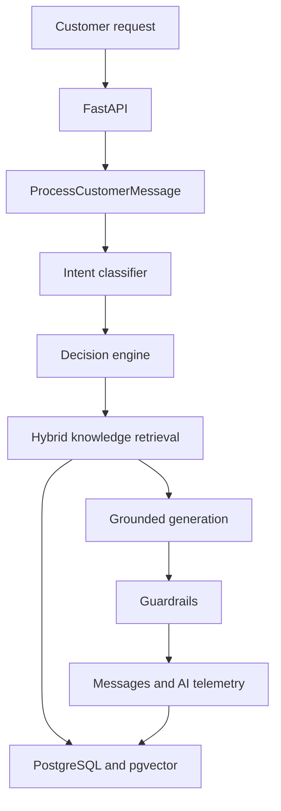

# CIMBA AI Customer Support Agent

CIMBA is an auditable AI customer-support backend built around grounded answer generation, hybrid knowledge retrieval, deterministic decision policies, guardrails, and complete AI-run telemetry.

The project also contains a Knowledge Management foundation for immutable document versioning, ingestion, chunking, embedding, publication, supersession, archival, and retrieval evaluation.

> **Current status:** backend vertical slice under active development. The customer chat UI, operations dashboard, Knowledge Management UI, ticket system, feedback system, and complete audit-event layer are planned but are not yet implemented.

## Current capabilities

- FastAPI application with health/readiness endpoints, stable error responses, and trace propagation.
- PostgreSQL persistence organized into `support`, `ai`, `knowledge`, `config`, and `audit` schemas.
- Conversation and message persistence with concurrency-safe message sequencing.
- Provider-neutral LLM integration with Groq and a configurable mock provider.
- Structured intent classification and deterministic decision routing.
- Grounded response generation with evidence and citation validation.
- Deterministic response guardrails with pass, refuse, and escalate outcomes.
- AI telemetry for runs, LLM calls, intent predictions, decisions, latency, token usage, and errors.
- Knowledge documents with immutable versions and controlled lifecycle transitions.
- Markdown/plain-text parsing, normalization, structural chunking, and provenance preservation.
- Jina document/query embeddings stored through PostgreSQL `pgvector`.
- PostgreSQL lexical search, vector search, Reciprocal Rank Fusion, optional reranking contracts, and context budgeting.
- Knowledge seeding and embedding-backfill command-line scripts.
- Retrieval evaluation using Hit@K, Hit Rate@K, Recall@K, Mean Recall@K, Reciprocal Rank, and MRR.
- Unit, API, integration, repository, provider, and live end-to-end test foundations.

## Intended product surfaces

The completed MVP will expose three primary interfaces:

1. **Customer workspace** — grounded chat, citations, ticket creation/tracking, escalation status, and answer/conversation feedback.
2. **Operations dashboard** — conversations, tickets, feedback, AI traces, retrieval evidence, guardrail outcomes, errors, latency, token usage, knowledge health, and customizable widgets.
3. **Knowledge Management console** — document creation, version history, processing, embedding, publishing, supersession, retry, and archival.

These interfaces are not part of the current backend-only implementation.

## Architecture



The main implemented request path is:

```text
HTTP request
  -> trace ID
  -> customer-message persistence
  -> AI run
  -> intent classification
  -> deterministic decision
  -> semantic + lexical query preparation
  -> vector + lexical retrieval
  -> Reciprocal Rank Fusion
  -> context selection and budgeting
  -> grounded answer generation
  -> guardrail evaluation
  -> assistant-message and telemetry persistence
```

## Repository layout

```text
.
├── apps/
│   └── api/app/                  # FastAPI application, routes, schemas, dependencies
├── packages/
│   ├── ai/                       # Intent, decision, generation, orchestration, providers
│   ├── application/              # Application use cases and dependency composition
│   ├── config/                   # Environment-backed settings
│   ├── database/                 # ORM models, repositories, sessions, Units of Work
│   ├── guardrails/               # Deterministic response safety checks
│   └── knowledge/                # KM domain, ingestion, embeddings, retrieval
├── evaluation/
│   └── retrieval/                # Evaluation models, metrics, relevance, runners
├── infra/database/               # PostgreSQL extension/schema initialization
├── migrations/                   # Alembic environment and revisions (name may vary)
├── knowledge_data/
│   ├── faqs/                     # Initial FAQ Markdown sources
│   └── policies/                 # Initial policy Markdown sources
├── scripts/
│   ├── seed_knowledge.py         # Idempotent document/version bootstrap
│   └── embed_knowledge.py        # Published-version embedding backfill
└── tests/                        # Unit, API, integration, evaluation, and live tests
```

## Technology stack

- Python 3.11+
- FastAPI and Pydantic v2
- SQLAlchemy 2 and Alembic
- PostgreSQL with `pgvector`
- Psycopg 3
- Groq for intent classification and grounded generation
- Jina embeddings (configured for 1024 dimensions by default)
- Pytest and Hypothesis

## Prerequisites

- Python 3.11 or newer
- PostgreSQL with the `vector` extension
- Access to a PostgreSQL role able to use the required schemas
- Groq API key for live LLM execution
- Jina API key for live embedding and hybrid retrieval execution

The existing database design also uses UUIDv7 generation. Ensure the database initialization supplied with the project has installed/configured the expected UUID function before running the migrations.

## Installation

From the repository root:

```bash
python -m venv .venv
```

Activate it on Linux/macOS:

```bash
source .venv/bin/activate
```

Activate it on Windows PowerShell:

```powershell
.venv\Scripts\Activate.ps1
```

Install dependencies:

```bash
python -m pip install --upgrade pip
python -m pip install -r requirements.txt
```

## Environment configuration

The settings module recognizes:

- `.env` for development
- `.env.test` for tests
- `.env.production` for production

Example development configuration:

```dotenv
APP_ENV=development
APP_NAME=support-ai

DATABASE_HOST=localhost
DATABASE_PORT=5432
DATABASE_NAME=support_ai
DATABASE_USER=support_ai_admin
DATABASE_PASSWORD=replace_me
DATABASE_ECHO=false

LLM_PROVIDER=groq
GROQ_API_KEY=replace_me
GROQ_MODEL=openai/gpt-oss-20b
GROQ_TIMEOUT_SECONDS=30
GROQ_MAX_COMPLETION_TOKENS=1024
GROQ_TEMPERATURE=0

EMBEDDING_PROVIDER=jina
EMBEDDING_DIMENSIONS=1024
EMBEDDING_BATCH_SIZE=16
JINA_API_KEY=replace_me
JINA_EMBEDDING_MODEL=jina-embeddings-v4
JINA_EMBEDDING_TIMEOUT_SECONDS=30

RAG_CONTEXT_MAX_TOKENS=6000
RAG_CONTEXT_MAX_BLOCKS=8
```

For `.env.test`, use `DATABASE_NAME=support_ai_test`. Never point destructive or cleanup-enabled tests at `support_ai`.

Do not commit any populated environment file or API key.

## Database setup

The project expects two databases during development:

| Database | Purpose |
|---|---|
| `support_ai` | Development and real-knowledge/live-provider execution |
| `support_ai_test` | Isolated automated integration testing |

Both databases use five schemas:

- `support`
- `ai`
- `knowledge`
- `config`
- `audit`

Run the supplied database initialization before Alembic so required extensions and schemas exist.

Apply development migrations:

```bash
alembic -x env=development upgrade head
```

Apply test migrations:

```bash
alembic -x env=test upgrade head
```

Inspect the active revision:

```bash
alembic -x env=test current
```

The exact Alembic configuration path may need to be supplied with `-c` if `alembic.ini` is not stored at the repository root.

## Seed and embed knowledge

Place initial Markdown documents under:

```text
knowledge_data/faqs/
knowledge_data/policies/
```

Seed documents, create changed versions, process chunks, and publish:

```bash
python -m scripts.seed_knowledge
```

The seed operation derives stable document IDs from source paths and hashes normalized content. Re-running it should skip unchanged knowledge and create a new immutable version when content changes.

Generate missing embeddings for all eligible published versions:

```bash
python -m scripts.embed_knowledge --environment development
```

Generate embeddings for one version:

```bash
python -m scripts.embed_knowledge --environment development --version-id <UUID>
```

## Run the API

From the repository root, run the FastAPI application module containing the exported `app` object. With the reconstructed application path, the expected command is:

```bash
uvicorn apps.api.app.main:app --reload
```

If the application entry file uses a different name in the final reconstructed tree, adjust only the module portion of this command.

Useful endpoints:

- `GET /v1/health` — process liveness
- `GET /v1/health/ready` — dependency readiness
- FastAPI API documentation — `/docs`
- OpenAPI schema — `/openapi.json`

The precise versioned customer-message route is defined by the routers under `apps/api/app/api/v1/` and is visible in `/docs`.

## Testing

Run tests that do not require live providers:

```bash
pytest -m "not live_provider and not live_embedding"
```

Run integration tests against `support_ai_test`:

```bash
pytest -m integration
```

Run Groq live tests explicitly:

```bash
pytest -m "live_provider"
```

Run embedding-provider live tests explicitly:

```bash
pytest -m "live_embedding"
```

Run the complete live smoke group explicitly:

```bash
pytest -m "live_smoke"
```

Some live tests intentionally target `support_ai` to use its published knowledge, while other smoke tests require `support_ai_test`. Read each live test's safety guard before execution. Never remove its database-name assertion merely to force a test to run.

Coverage:

```bash
pytest --cov=packages --cov=apps --cov-report=term-missing
```

## Knowledge lifecycle

```text
draft -> processing -> ready -> published -> superseded
             |
             -> failed -> processing (retry)
```

- Source content is immutable within a version.
- Updating authoritative content creates a new version.
- Processing creates reproducible chunks.
- Embedding artifacts retain provider/model/configuration identity.
- Publishing a new version supersedes the previously published version atomically.
- Retrieval considers active documents and compatible, successfully ingested, published versions.

## Retrieval pipeline

The default customer-support retrieval profile enables:

- vector candidate limit: 20
- lexical candidate limit: 20
- fused candidate limit: 20
- final candidate limit: 8
- Reciprocal Rank Fusion `k`: 60
- reranking: disabled (passthrough contract available)
- grounding budget: 6000 estimated tokens and 8 blocks by default

Vector, lexical, fusion, reranker, and context scores are kept separate because they have different meanings and scales.

## Observability and safety

The current implementation records structured AI telemetry including:

- AI run status and total latency
- provider/model call purpose
- LLM call status, latency, token usage, and sanitized errors
- intent prediction and confidence
- deterministic decision and reason
- trace linkage across request, conversation, messages, and AI records

Guardrails reject incompatible or unsupported responses before they become customer-visible. In particular, the system must not claim sensitive actions or customer-specific operational facts without trusted operational evidence.

The planned MVP adds append-only `audit.events`, complete retrieval/generation/guardrail stage events, ticket/feedback events, a redaction policy, and dashboard trace exploration. Secrets, authorization headers, database credentials, full embedding vectors, and unnecessary duplicated customer content must never be logged.

## Known limitations

- Operational retrieval (such as live order or payment status) is not implemented.
- Escalation ORM work is incomplete: migration, registration, repository, Unit of Work, and service/API wiring remain.
- Ticket management and customer feedback are not implemented.
- The `audit` schema does not yet contain the planned immutable event stream.
- Knowledge application use cases are not yet exposed through a complete admin API.
- No customer, operations, or Knowledge Management frontend currently exists.
- Reranking is currently a passthrough implementation.
- The knowledge seed script constructs ingestion dependencies locally instead of using one shared API/CLI/worker composition factory.
- Production authentication, authorization, deployment, and privacy controls remain future work.

## MVP roadmap

The recommended completion order is:

1. Establish a clean migration and test baseline.
2. Complete escalation and ticket persistence.
3. Add feedback and immutable audit events.
4. Expose conversation, ticket, feedback, knowledge, and observability APIs.
5. Build customer chat with ticket tracking and feedback controls.
6. Build the Knowledge Management console.
7. Build the operations dashboard, trace explorer, ticket queue, feedback insights, logs, and saved widget layouts.
8. Evaluate at least 50 representative conversations and publish the results.

See `CIMBA_MVP_COMPLETION_ROADMAP.md` for the detailed file-by-file implementation plan.

## Development rules

- Preserve domain and application boundaries; do not import SQLAlchemy models into AI/domain code.
- Keep transaction ownership in Units of Work and commit explicitly.
- Do not mutate published knowledge source content.
- Do not compare lexical and vector scores directly; use rank fusion.
- Propagate trace IDs through every new application action and telemetry record.
- Add stable error codes rather than exposing provider/database exceptions to clients.
- Add tests for lifecycle transitions, rollback, access control, and failure behavior.
- Keep live-provider tests opt-in.

## Project status

This repository is an assignment implementation in progress. It should not yet be treated as a production customer-support system.
