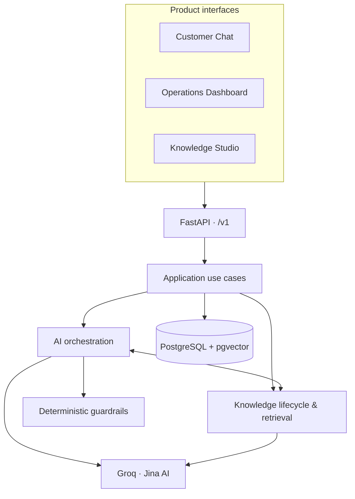
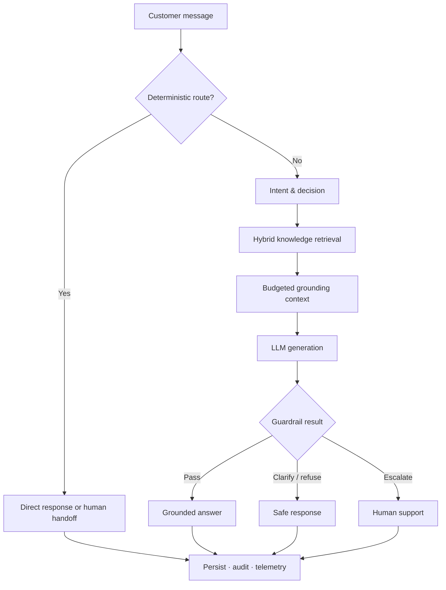
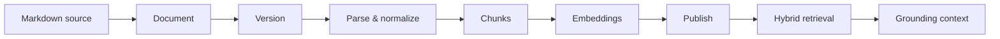

<div align="center">

# AI Customer Support Agent

### Grounded answers. Human-aware escalation. Observable AI operations.

A production-oriented customer-support platform that combines a responsive customer chat, an operations dashboard, and a complete knowledge-management workflow with a controlled, retrieval-grounded AI pipeline.

[](https://www.python.org/)
[](https://fastapi.tiangolo.com/)
[](https://react.dev/)
[](https://www.typescriptlang.org/)
[](https://www.postgresql.org/)

[Features](#-why-this-project) · [Architecture](#-architecture) · [Quick start](#-quick-start) · [Knowledge seeding](#-seed-the-knowledge-base) · [API](#-api-and-contracts) · [Testing](#-quality-gates)

</div>

---

## ✨ Why this project

This is more than a chat box around an LLM. It is an end-to-end support system built around explicit contracts, trusted evidence, safety boundaries, operational visibility, and a clean separation between product workflows and AI providers.

| Experience | What it provides |
|---|---|
| **Customer Chat** | Conversation history, grounded AI answers, feedback, conversation closure, and human-support requests |
| **Operations Dashboard** | Conversations, escalations, tickets, feedback, retrieval activity, AI latency, failures, and provider telemetry |
| **Knowledge Studio** | Document upload, processing, versioning, embedding, publishing, search, and archival |
| **AI Runtime** | Deterministic routing, intent analysis, hybrid retrieval, grounded generation, guardrails, and safe outcomes |

### Engineering highlights

- **Grounded RAG** over published, versioned knowledge instead of unrestricted model recall.
- **Hybrid retrieval** combining semantic vector search and lexical search, followed by rank fusion.
- **Cost-aware routing** that handles high-confidence greetings, acknowledgements, capability questions, and explicit human requests without unnecessary LLM calls.
- **Bounded context** for both conversation history and evidence, including per-document diversity limits.
- **Provider protection** through concurrency limits, start-rate spacing, queue timeouts, bounded retries, and jitter.
- **Process-local query-embedding cache** with TTL, LRU eviction, and single-flight behavior.
- **Deterministic guardrails** between model generation and customer-visible responses.
- **First-class observability** for HTTP requests, AI runs, stages, LLM calls, embeddings, retrieval, and failures.
- **Contract-first frontend** generated from the committed OpenAPI schema.
- **Human handoff workflows** through escalations and support tickets.

## 🧰 Technology stack

<div align="center">

### Product interfaces

[](https://react.dev/)
[](https://www.typescriptlang.org/)
[](https://vite.dev/)
[](https://reactrouter.com/)
[](https://tanstack.com/query)
[](https://zod.dev/)

### API, data, and AI

[](https://fastapi.tiangolo.com/)
[](https://docs.pydantic.dev/)
[](https://www.sqlalchemy.org/)
[](https://alembic.sqlalchemy.org/)
[](https://github.com/pgvector/pgvector)
[](https://groq.com/)
[](https://jina.ai/)

### Quality

[](https://pytest.org/)
[](https://jestjs.io/)
[](https://testing-library.com/)
[](https://playwright.dev/)
[](https://www.openapis.org/)

</div>

## 🏗 Architecture

The repository uses a layered, provider-independent architecture. HTTP and UI concerns remain at the edges; application services coordinate business workflows; AI, knowledge, guardrails, and persistence stay behind explicit boundaries.



### Grounded answer lifecycle



### Knowledge lifecycle



> The current retrieval path fuses vector and lexical candidates. The reranker boundary exists, but the active implementation is passthrough rather than a learned/provider reranker.

## 📁 Repository map

```text
AI-customer-support-agent/
├── apps/
│   ├── api/                 # FastAPI composition, routes, middleware, HTTP contracts
│   └── web/                 # React customer, operations, and knowledge interfaces
├── packages/
│   ├── application/         # Use cases, workflows, authorization, composition
│   ├── ai/                  # Intent, decisions, generation, orchestration, telemetry
│   ├── knowledge/           # Ingestion, chunking, embeddings, retrieval, grounding
│   ├── guardrails/          # Deterministic response safety checks
│   ├── database/            # SQLAlchemy models, repositories, sessions, UoW
│   └── config/              # Validated environment configuration
├── migrations/              # Alembic migration environment and revision history
├── scripts/                 # Bootstrap, seeding, embedding, contract, diagnostics
├── knowledge_data/
│   ├── faqs/                # Repository-managed FAQ sources
│   └── policies/            # Repository-managed policy sources
├── contracts/
│   └── openapi.json         # Committed API source of truth for the frontend
└── tests/                   # Unit, integration, and live-provider test suites
```

> You can find out README.md files in each section to understand more about the problem, the approach how it was handeled.

## 🚀 Quick start

### Prerequisites

- Python **3.11+** and `pip`
- Node.js and `npm` supported by the frontend lockfile
- PostgreSQL with the **pgvector** extension available
- A Groq API key
- A Jina AI API key

The default local URLs are:

| Service | URL |
|---|---|
| Frontend | `http://localhost:5173` |
| API | `http://localhost:8000` |
| Swagger UI | `http://localhost:8000/docs` |
| ReDoc | `http://localhost:8000/redoc` |
| OpenAPI schema | `http://localhost:8000/openapi.json` |

### 1. Clone and install the backend

```bash
git clone <repository-url>
cd AI-customer-support-agent

python -m venv .venv
source .venv/bin/activate
python -m pip install --upgrade pip
pip install -r requirements.txt
```

On Windows PowerShell, activate the environment with:

```powershell
.\.venv\Scripts\Activate.ps1
```

### 2. Configure the environment

```bash
cp .env.example .env
```

PowerShell:

```powershell
Copy-Item .env.example .env
```

At minimum, replace the example database password and provider keys, and generate a JWT secret of at least 32 bytes:

```bash
python -c "import secrets; print(secrets.token_urlsafe(48))"
```

Key settings:

```env
APP_ENV=development
AUTH_JWT_SECRET=<generated-secret>

DATABASE_HOST=localhost
DATABASE_PORT=5432
DATABASE_NAME=support_ai
DATABASE_USER=support_ai_admin
DATABASE_PASSWORD=<your-password>

LLM_PROVIDER=groq
GROQ_API_KEY=<your-groq-key>

EMBEDDING_PROVIDER=jina
JINA_API_KEY=<your-jina-key>

BROWSER_ALLOWED_ORIGINS=["http://localhost:5173"]
AUTH_REFRESH_COOKIE_SECURE=false
```

Do not commit `.env` or real credentials. The complete configuration surface—including provider capacity, retries, conversation context, RAG budgets, title generation, analytics caching, and embedding caching—is documented by `.env.example` and `packages/config/`.

### 3. Prepare PostgreSQL

Create the configured database/user, ensure pgvector is installed on the PostgreSQL server, then apply the versioned schema from the repository root:

```bash
alembic -x env=development upgrade head
alembic -x env=development current
```

The development database name expected by repository bootstrap utilities is `support_ai`. Alembic reads database settings through the application configuration; the placeholder URL in `alembic.ini` is not the runtime connection string.

### 4. Seed the knowledge base

Place Markdown knowledge in:

```text
knowledge_data/faqs/
knowledge_data/policies/
```

Then run:

```bash
python scripts/seed_knowledge.py
```

The seeder discovers source files, normalizes and hashes content, creates or updates documents, creates versions, processes them, and publishes them. It uses stable source identities and reports created, processed, published, skipped, and failed items, making repeated bootstrap runs safe.

Backfill embeddings for all eligible published versions:

```bash
python scripts/embed_knowledge.py
```

Or target a single version:

```bash
python scripts/embed_knowledge.py --version-id <version-uuid>
```

Both knowledge utilities intentionally refuse to operate against an unexpected database name.

### 5. Provision an administrator

```bash
python scripts/create_admin.py
```

This development-only utility validates the environment and database, applies the application password policy and Argon2 hashing, and asks you to type `support_ai` before writing.

### 6. Start the backend

```bash
uvicorn apps.api.app.main:app --reload --host 0.0.0.0 --port 8000
```

Check that both process health and dependency readiness succeed:

```bash
curl http://localhost:8000/v1/health
curl http://localhost:8000/v1/health/ready
```

### 7. Start the frontend

In a second terminal:

```bash
cd apps/web
npm install
cp .env.example .env.local
npm run api:generate
npm run dev
```

PowerShell environment copy:

```powershell
Copy-Item .env.example .env.local
```

Set the frontend API URL if it is not already present:

```env
VITE_API_BASE_URL=http://localhost:8000
```

Open `http://localhost:5173`, sign in with the provisioned account, and explore Customer Chat, Operations, and Knowledge Studio.

## 🔌 API and contracts

The versioned API includes resources for authentication, users, conversations, tickets, knowledge, feedback, escalations, dashboards, and health checks under `/v1`.

`contracts/openapi.json` is the committed transport contract and the source for generated frontend types. After changing an API schema:

```bash
python scripts/export_openapi.py

cd apps/web
npm run api:generate
npm run api:check
npm run typecheck
```

Detect backend contract drift without rewriting the contract:

```bash
python scripts/export_openapi.py --check
```

Generated frontend declarations should never be edited by hand.

## 🧪 Quality gates

### Backend

```bash
pytest
```

Tests that require infrastructure or real providers are explicitly marked:

```bash
pytest -m integration
pytest -m live_provider
pytest -m live_embedding
pytest -m live_smoke
```

Real-provider suites can consume quota and require valid credentials; run them deliberately.

### Frontend

```bash
cd apps/web
npm run api:check
npm run typecheck
npm run lint
npm run test
npm run build
npx playwright test
```

**Few Test files aren't updated as per recent Production files!! Don't worry about them**

## 🛡 Security and reliability model

- JWT access and refresh-token flows with configurable expiry, clock skew, login lockout, and browser-origin policy.
- Argon2 password hashing for provisioned accounts.
- Request-scoped database sessions and explicit transaction boundaries.
- Idempotency protection for conversation-start processing.
- Untrusted-input boundaries and evidence allowlists in AI prompting.
- Deterministic refusal, clarification, and escalation outcomes.
- Sanitized request, AI-stage, provider-call, embedding, and retrieval telemetry.
- Test-database migration guards that reject an unexpected database name.
- Short-lived database work around remote provider calls.

## ⚙️ Useful operations

| Goal | Command |
|---|---|
| Apply all migrations | `alembic -x env=development upgrade head` |
| Inspect migration state | `alembic -x env=development current` |
| Seed repository knowledge | `python scripts/seed_knowledge.py` |
| Backfill published embeddings | `python scripts/embed_knowledge.py` |
| Provision the first admin | `python scripts/create_admin.py` |
| Register a local test customer | `python scripts/register_customer.py` |
| Export OpenAPI | `python scripts/export_openapi.py` |
| Check OpenAPI drift | `python scripts/export_openapi.py --check` |
| Build the web application | `cd apps/web && npm run build` |

## 🤝 Contributing

1. Create a focused branch.
2. Keep HTTP, application, AI, knowledge, guardrail, and persistence responsibilities inside their existing boundaries.
3. Add or update tests for behavior changes.
4. Regenerate the OpenAPI contract and frontend types when transport schemas change.
5. Run the relevant quality gates before opening a pull request.
6. Never commit credentials, local environment files, or customer-sensitive data.

When changing the database, review generated Alembic revisions manually—especially constraints, indexes, defaults, enum changes, PostgreSQL-specific objects, and destructive operations.

## 🧭 Project principles

> **Evidence before generation. Contracts before coupling. Observability before guesswork. Humans when automation should stop.**

The system is designed so each capability can evolve independently: providers can change without rewriting orchestration, retrieval can improve without leaking into HTTP handlers, and the frontend can evolve against a stable generated contract.

---

<div align="center">

Built as a serious foundation for safe, explainable, and operable AI customer support.

</div>
