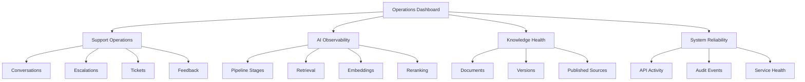
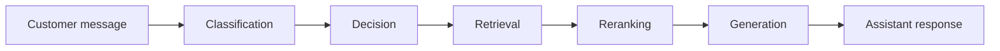
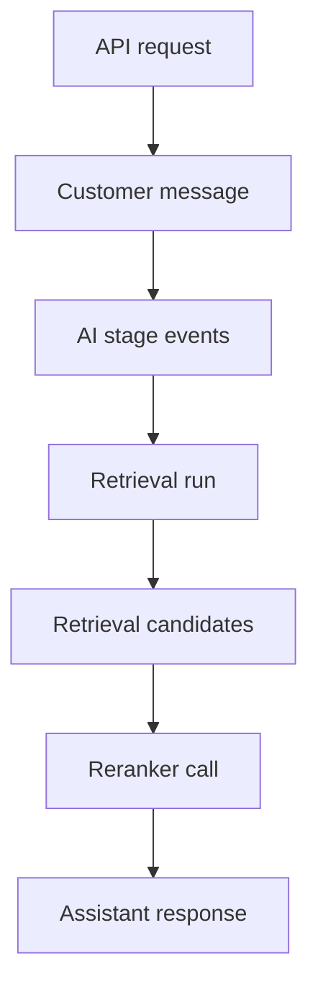
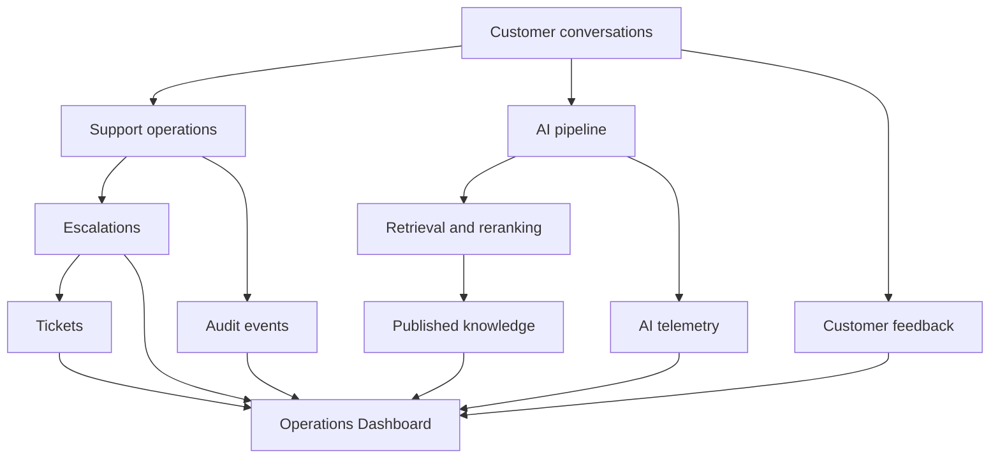
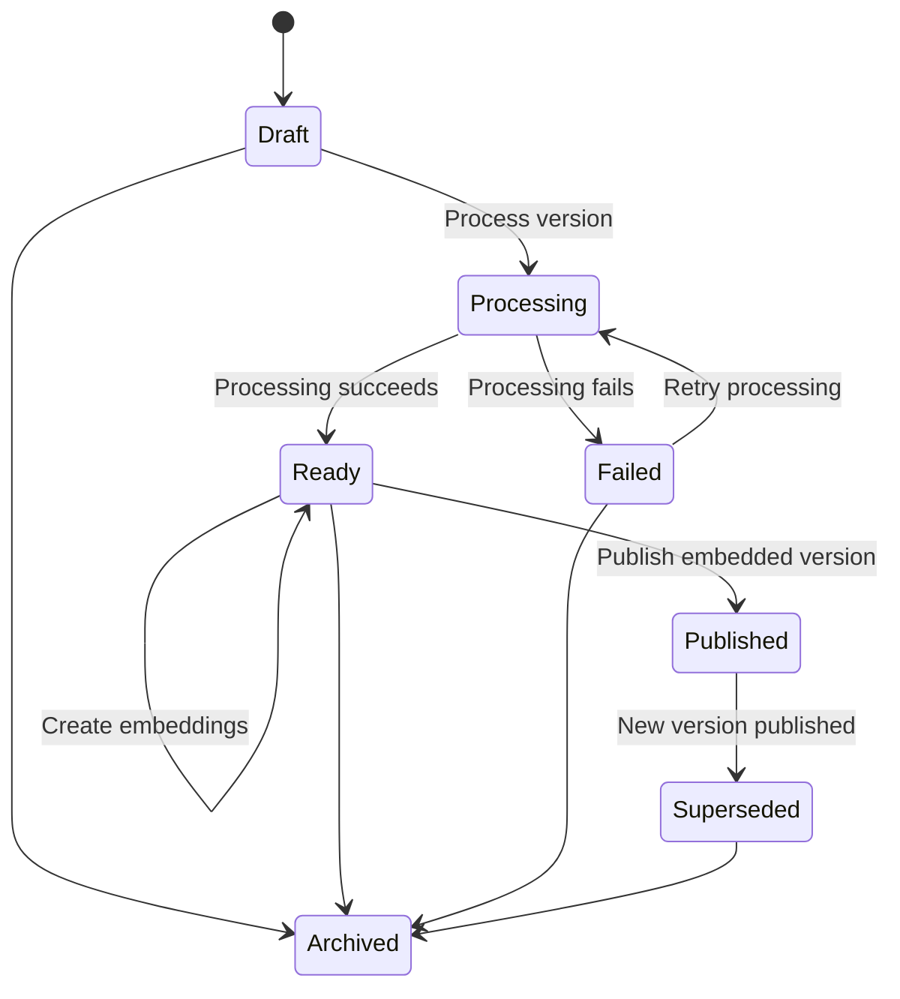
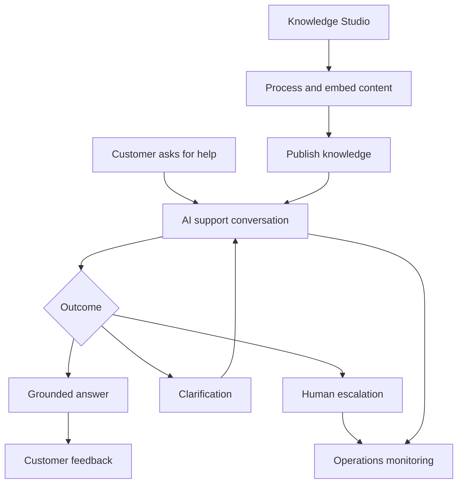

# AI Customer Support Agent — Frontend

A production-oriented React frontend for an AI-powered customer support platform.

The application provides three connected interfaces:

1. **Customer Chat** — customers can create conversations, communicate with the AI support agent, request human assistance, close conversations, and rate responses.
2. **Operations Dashboard** — administrators and support operators can monitor system activity, conversations, escalations, tickets, feedback, AI telemetry, and operational health.
3. **Knowledge Studio** — authorized users can upload, process, embed, publish, version, and archive the knowledge used by the AI support agent.

All interfaces share a consistent visual language based on a sober white-and-rose design system, magenta primary actions, responsive layouts, subtle animations, and accessible interaction states.

---

## Table of Contents

- [Technology Stack](#technology-stack)
- [Application Overview](#application-overview)
- [Core Features](#core-features)
  - [Authentication](#authentication)
  - [Customer Chat](#customer-chat)
  - [Operations Dashboard](#operations-dashboard)
  - [Knowledge Studio](#knowledge-studio)
- [Knowledge Version Lifecycle](#knowledge-version-lifecycle)
- [Project Structure](#project-structure)
- [Frontend Architecture](#frontend-architecture)
- [API Contract](#api-contract)
- [Prerequisites](#prerequisites)
- [Local Development Setup](#local-development-setup)
- [Environment Configuration](#environment-configuration)
- [Available Commands](#available-commands)
- [Testing](#testing)
- [End-to-End Testing](#end-to-end-testing)
- [Styling and Design System](#styling-and-design-system)
- [Authentication and Session Handling](#authentication-and-session-handling)
- [Error Handling](#error-handling)
- [Accessibility](#accessibility)
- [Responsive Design](#responsive-design)
- [Production Build](#production-build)
- [Backend Integration](#backend-integration)
- [Development Workflow](#development-workflow)
- [Troubleshooting](#troubleshooting)
- [Definition of Done](#definition-of-done)

---

## Technology Stack

The frontend is built with:

- **React 19** for UI composition
- **TypeScript** for static type safety
- **Vite** for development and production builds
- **React Router** for client-side routing
- **TanStack React Query** for server-state management
- **React Hook Form** for form state
- **Zod** for runtime validation
- **Lucide React** for icons
- **Motion** for focused UI animations
- **Jest** for unit and component testing
- **React Testing Library** for behavior-focused UI testing
- **Playwright** for browser-level end-to-end testing
- **openapi-typescript** for generated API types

The frontend does not maintain a separate handwritten representation of the backend API. Its transport types are generated from the backend OpenAPI contract.

---

## Application Overview

The frontend is a single React application located under:

```text
apps/web/
```

Its major product areas are available through the following routes:

| Route                                                  | Interface            | Purpose                                   |
| ------------------------------------------------------ | -------------------- | ----------------------------------------- |
| `/login`                                               | Authentication       | Sign in to the application                |
| `/chat`                                                | Customer Chat        | Customer conversations and AI support     |
| `/operations`                                          | Operations Dashboard | Administrative and operational monitoring |
| `/knowledge`                                           | Knowledge Studio     | Search and manage knowledge documents     |
| `/knowledge/documents/:documentId`                     | Document Details     | Inspect a document and its versions       |
| `/knowledge/documents/:documentId/versions/:versionId` | Version Details      | Inspect and control a version lifecycle   |

Protected routes require an authenticated session. Role-sensitive actions are only shown when the current user has the required permission.

---

# Core Features

## Authentication

The authentication experience provides:

- Email/username and password sign-in
- Schema-based form validation
- Clear validation and authentication errors
- Duplicate-submission protection
- Loading feedback while authentication is in progress
- Automatic session restoration
- Access-token and refresh-token coordination
- Protected application routes
- Role-aware navigation
- Graceful handling of expired sessions
- Sign-out confirmation
- Automatic redirection after sign-out
- Prevention of authenticated users returning to the sign-in screen unnecessarily

### Sign-in experience

The sign-in page uses the shared visual identity of the product:

- Soft animated background imagery
- Low-opacity background transitions
- Magenta glow around the authentication panel
- High-contrast form controls
- Clear keyboard focus states
- Responsive behavior for desktop and smaller screens

Authentication failures remain within the sign-in experience and never expose raw backend implementation details.

---

## Customer Chat

Customer Chat is the primary customer-facing interface.

It uses a two-column layout on larger screens:

- The left side contains the conversation navigator.
- The right side contains the selected conversation and message composer.

On smaller screens, the layout adapts to maintain readable messages and touch-friendly controls.

### Conversation navigation

The conversation sidebar supports:

- Listing the current customer’s conversations
- Creating a new conversation
- Opening an existing conversation
- Refreshing the conversation list
- Paginated conversation navigation
- Hiding Previous and Next controls when no corresponding page exists
- Displaying conversation title, status, and recent activity
- Clearly indicating the active conversation
- Showing a focused empty state before a conversation is selected
- Signing out through a compact icon action

The Refresh and Sign Out actions use accessible labels and explanatory tooltips.

### Conversation header

The active conversation header displays:

- Product heading
- Conversation title
- Current conversation status
- Conversation-close action
- Human-support or escalation control when applicable

The human-support control is only displayed when relevant escalation data is available.

Selecting it opens a contextual side panel containing the available escalation information without navigating away from the conversation.

### Message thread

The conversation thread supports:

- Customer messages
- Assistant messages
- Chronological message history
- Distinct customer and assistant presentation
- Automatic scrolling toward recent messages
- Smooth response appearance
- Copying assistant responses
- Loading feedback while a response is being prepared
- Clear failure and retry states
- Long-message wrapping
- Preserved whitespace where appropriate
- Conversation-aware response rendering

The backend uses a normal HTTP request/response flow. The frontend shows an honest processing state and then animates the completed response into view. It does not simulate network-level token streaming.

### Message composer

The composer provides:

- A floating, rounded input surface
- Automatic vertical growth while typing
- An internal scrollbar after the maximum height is reached
- Send-button loading and disabled states
- Protection against blank messages
- Protection against duplicate submissions
- Keyboard submission
- `Ctrl + Enter` submission support
- Focus management after successful submission
- Clear state handling for closed conversations

### AI response outcomes

The interface can represent the backend’s supported response outcomes, including:

- Grounded support answers
- Clarification requests
- Safe refusals
- Escalation guidance
- Explicit pipeline failure states
- Retryable request failures

When the API provides supporting evidence or source information, the response can display it without fabricating citations on the client.

### Conversation closure

Customers can close an active conversation through a confirmation dialog.

The dialog includes:

- Background blur
- Clear confirmation text
- Solid magenta primary action
- White secondary action with magenta border
- Pending-state feedback
- Keyboard-accessible controls
- Escape and close handling when safe

Once closed, the interface updates the conversation state and prevents invalid message submissions.

### Human support and escalation

When human support is associated with a conversation, the interface can show:

- Escalation status
- Escalation reason
- Priority
- Recorded timestamps
- Resolution information
- Related support details supplied by the backend

The frontend only displays real escalation or ticket data received from the API.

### Feedback and rating

Assistant responses can be rated using a five-star feedback control.

The rating experience includes:

- Five interactive stars
- Keyboard-operable rating selection
- Progressive star highlighting on hover
- Magenta active color
- Soft pink active fill
- Text feedback for each rating:

| Rating | Label     |
| -----: | --------- |
|      1 | Poor      |
|      2 | Fair      |
|      3 | Good      |
|      4 | Very good |
|      5 | Excellent |

The feedback form also provides:

- A disabled submit button until a rating is selected
- Pending-state feedback
- Success confirmation
- Error recovery
- Playful but restrained hover animation
- A compact card visually integrated with assistant messages

Feedback is associated with the correct conversation and assistant message through the backend contract.

---

## Operations Dashboard

The Operations Dashboard is the administrative control center of the AI Customer Support Agent.

It brings together customer-support activity, human-escalation workflows, ticket operations, customer feedback, AI execution telemetry, retrieval behavior, Knowledge Studio health, audit events, and service readiness in one interface.

The dashboard is designed for:

- Support administrators
- Support operations teams
- Human support agents
- AI operations engineers
- Knowledge managers
- Engineering and reliability teams
- Product owners reviewing support quality

The dashboard does not merely display static statistics. It provides an operational view of how customer requests move through the system—from message submission to AI response, knowledge retrieval, escalation, ticket resolution, and customer feedback.

---

### Dashboard Goals

The Operations Dashboard answers practical questions such as:

- How many customer conversations are currently active?
- How many conversations were completed or closed?
- Which conversations require human assistance?
- Are escalations being acknowledged and resolved?
- How many support tickets are open?
- What priorities are assigned to those tickets?
- Are customers satisfied with AI-generated responses?
- Which AI pipeline stages are failing?
- Are embedding, retrieval, reranking, and generation providers healthy?
- Is published knowledge available for retrieval?
- How frequently is the knowledge base being used?
- Are API requests failing or slowing down?
- What important administrative actions were performed?
- Is the complete platform ready to serve customer requests?

---

## Dashboard Information Architecture

The dashboard is organized into several operational layers:



Each layer is represented through independently loading dashboard widgets.

A failure in one widget does not prevent other operational information from being displayed.

---

## Main Dashboard Layout

The desktop dashboard uses four primary regions:

1. **Dashboard header**
2. **Global filter and action bar**
3. **Draggable widget grid**
4. **Contextual detail panel**

### Dashboard header

The header introduces the operational workspace and displays:

- Dashboard title
- Short description
- Current environment when provided
- Last successful refresh time
- Overall service-health indicator
- Manual refresh action
- Dashboard customization action
- Navigation to other product areas
- Authenticated-user controls

The heading remains visually distinct from widget content and provides immediate confirmation that the user is inside the administrative interface.

### Global filter bar

Global filters allow operators to narrow the dashboard without configuring every widget independently.

Supported filters depend on the backend contract and can include:

- Time range
- Conversation status
- Escalation status
- Ticket status
- Ticket priority
- Feedback rating
- AI provider
- Embedding provider
- Reranker provider
- Knowledge document
- Knowledge content type
- API outcome
- Search or correlation identifier

Applying a global filter updates every compatible widget.

Widgets that do not use a selected filter continue to operate normally rather than displaying incorrect empty results.

### Selected filters

Active filters are displayed as removable filter chips.

Users can:

- Remove one filter
- Clear all filters
- Change the selected time range
- Refresh the filtered dashboard
- Share or revisit URL-representable dashboard state

Where appropriate, filters and time ranges are reflected in URL search parameters so navigation and browser refresh do not unexpectedly reset the operational context.

---

## Dashboard Time Ranges

The dashboard can provide common operational time windows such as:

- Last hour
- Last 24 hours
- Last 7 days
- Last 30 days
- Custom range

Every time-based widget clearly displays the period represented by its data.

Time values are formatted consistently in the user’s local display context while preserving backend timestamps as authoritative values.

The frontend does not calculate unavailable historical metrics from incomplete datasets. Trends and comparisons are shown only when the API provides sufficient data.

---

# Configurable Widget Workspace

The dashboard is designed as a low-code operational workspace.

Authorized users can arrange widgets according to their responsibilities without modifying application code.

## Widget capabilities

Dashboard widgets support:

- Drag-and-drop repositioning
- Responsive grid placement
- Defined minimum dimensions
- Clear drag handles
- Visual drop targets
- Focus and hover states
- Widget-level refresh
- Widget-level loading state
- Widget-level error recovery
- Empty-state explanations
- Contextual actions
- Optional expansion
- Detail inspection
- Stable content while background refresh occurs

### Edit mode

The dashboard provides a dedicated customization mode.

While edit mode is active:

- Drag handles become visible
- Drop targets are highlighted
- Movable widgets receive a clear visual outline
- Widget content remains identifiable
- Accidental operational actions are suppressed
- Layout changes can be confirmed or cancelled
- Keyboard-accessible movement controls are available

Outside edit mode, the dashboard behaves as a normal monitoring interface and does not accidentally move widgets during selection or scrolling.

### Widget movement

While dragging a widget:

- The selected widget receives an elevated visual state
- Its current position is represented by a placeholder
- Valid target positions are highlighted
- Other widgets reposition smoothly
- Invalid placement is rejected
- The grid remains within its configured boundaries

### Responsive widget placement

Widget placement adapts by viewport size:

- Large desktop: multi-column operational grid
- Standard desktop: reduced column count
- Tablet: compact two-column or stacked grid
- Mobile: single-column layout

Desktop positioning does not cause widgets to overlap or disappear on smaller screens.

### Widget catalog

The customization experience can present a widget catalog grouped by operational purpose:

- Support overview
- Conversation operations
- Escalation operations
- Ticket operations
- Customer feedback
- AI execution
- Retrieval and ranking
- Knowledge health
- Audit activity
- Platform health

Only widgets supported by the current user’s permissions and the backend contract are made available.

---

# Dashboard Widget States

Every widget implements a consistent state model.

## Loading state

During initial loading, a widget displays:

- Stable card dimensions
- Skeleton content or an appropriate progress indicator
- Accessible loading text
- Preserved dashboard layout

Widgets do not collapse during loading.

## Background refresh state

When previously loaded data is being refreshed:

- Existing data remains visible
- A subtle refresh indicator appears
- The widget avoids disruptive flashing
- Interactive drill-down actions remain stable where safe

## Empty state

An empty widget explains what the absence of data means.

Examples:

- No escalations were created in this period
- No unresolved tickets match the selected filters
- No customer feedback has been recorded
- No retrieval runs match the current query
- No provider failures were recorded
- No audit events match the selected range

An empty result is not presented as an error.

## Error state

If a widget request fails, the widget displays:

- Clear error title
- Short user-facing explanation
- Retry action
- Preserved widget position
- No raw exception or sensitive backend details

Other widgets continue functioning.

## Success state

Successfully loaded widgets display:

- Metric or visualization
- Applicable time range
- Supporting context
- Optional trend
- Last-updated information
- Drill-down action when supported

---

# Operational Summary Widgets

The top dashboard region contains high-priority summary cards.

These cards provide a quick overview before the operator inspects detailed widgets.

## Total conversations

Displays the total number of conversations matching the active dashboard filters.

Supporting information can include:

- Open conversations
- Closed conversations
- Conversations created in the selected period
- Change from the comparable previous period when supplied

## Active conversations

Displays conversations currently considered active by the backend.

The card can help operators identify current customer-service load.

## Escalations requiring attention

Displays escalations that require human acknowledgment, assignment, investigation, or resolution.

The visual treatment becomes more prominent when actionable escalations exist.

## Open tickets

Displays tickets that are not yet in a terminal state.

Supporting information may include:

- Priority distribution
- Unassigned tickets
- Recently created tickets
- Tickets awaiting resolution

## Customer satisfaction

Displays aggregated feedback using backend-provided ratings.

The card can show:

- Average rating
- Number of ratings
- Positive-rating percentage
- Rating distribution
- Difference from the previous period when available

The dashboard never presents an average without its supporting sample count.

## Knowledge readiness

Summarizes whether usable published knowledge is available to the AI support pipeline.

Supporting information can include:

- Active documents
- Published versions
- Fully embedded versions
- Documents requiring attention
- Recent knowledge activity

## Platform readiness

Displays the latest backend health and readiness information.

It distinguishes:

- API process availability
- Dependency readiness
- Degraded conditions
- Unavailable dependencies

---

# Conversation Operations

Conversation widgets show how customers are interacting with the support platform.

## Conversation status distribution

This widget visualizes conversations grouped by backend-defined status.

It can be represented as:

- Donut chart
- Segmented bar
- Compact status list

Each segment includes:

- Status label
- Conversation count
- Percentage of the filtered total

Selecting a segment applies or opens the corresponding conversation filter when supported.

## Conversation activity over time

Displays conversation volume across the selected time period.

The chart can show:

- Conversations created
- Conversations closed
- Messages submitted
- Assistant responses generated

The chart uses readable time buckets appropriate for the selected range.

For example:

- Hourly buckets for short ranges
- Daily buckets for weekly or monthly ranges

## Recent conversations

Displays the most recently active conversations.

Each row can include:

- Conversation title
- Current status
- Customer reference when permitted
- Last activity
- Message count when supplied
- Escalation indicator
- Feedback indicator

Selecting a conversation opens its operational detail view or navigates to the relevant conversation context.

## Conversation outcome distribution

Shows the distribution of supported AI/customer-service outcomes, such as:

- Grounded answer
- Clarification
- Safe refusal
- Escalation
- Explicit pipeline failure

Outcome labels come from backend data and are converted into readable presentation labels.

## Message activity

Summarizes message traffic, including:

- Customer messages
- Assistant messages
- Total message volume
- Average messages per conversation when supplied
- Message activity trend

Customer and assistant messages remain visually distinct.

---

# Escalation Operations

Escalation widgets help support teams identify conversations requiring human intervention.

## Escalation overview

Displays:

- Total escalations
- Open escalations
- Acknowledged escalations
- Resolved escalations
- Escalations created during the selected period

Statuses and allowed actions follow the backend lifecycle.

## Escalations by priority

Groups escalations according to their recorded priority.

The visualization uses:

- Text labels
- Counts
- Accessible status indicators
- Color as a supporting cue rather than the only indicator

## Escalation queue

Displays actionable escalations in a table or compact queue.

Each item can include:

- Escalation identifier
- Related conversation
- Reason
- Priority
- Current status
- Creation time
- Assigned operator when supplied
- Last-updated time

Selecting an escalation opens a contextual detail panel.

## Escalation detail panel

The side panel can display:

- Escalation ID
- Conversation ID
- Related customer context where authorized
- Trigger or reason
- Priority
- Status
- Assignment
- Creation timestamp
- Acknowledgment timestamp
- Resolution timestamp
- Resolution notes
- Related ticket information when supplied
- Associated audit activity

The panel closes without losing the dashboard’s filters, scroll position, or widget arrangement.

## Escalation aging

When the API supplies sufficient timestamp data, an aging widget can group unresolved escalations by elapsed time.

This helps operators identify older unresolved work without the frontend inventing service-level guarantees.

---

# Ticket Operations

Ticket widgets provide visibility into structured support work.

## Ticket status overview

Displays tickets grouped by their backend-defined status.

Information can include:

- Open tickets
- In-progress tickets
- Resolved tickets
- Closed tickets
- Other supported lifecycle states

## Ticket priority distribution

Shows how open work is distributed across supported priorities.

Each priority displays:

- Label
- Count
- Percentage
- Accessible visual marker

## Ticket queue

The operational ticket queue can display:

- Ticket ID
- Title or summary
- Related conversation
- Related escalation when present
- Priority
- Status
- Assignee when supplied
- Creation time
- Last-updated time

The queue supports backend-defined filtering and pagination.

## Ticket detail interaction

Selecting a ticket can open a detail panel containing:

- Ticket metadata
- Customer-support context
- Related conversation
- Related escalation
- Status history when supplied
- Assignment information
- Resolution information
- Audit events
- Relevant timestamps

The frontend maintains the distinction between:

- Conversation
- Escalation
- Ticket

It does not imply that every escalation has a ticket or that every ticket was automatically created from an escalation unless the backend explicitly records that relationship.

---

# Customer Feedback Analytics

Feedback widgets help teams understand response quality from the customer’s perspective.

## Average rating

Displays:

- Average rating
- Total rating count
- Selected time range

The sample count is always displayed alongside the average.

## Rating distribution

Shows the number or percentage of submitted ratings:

| Rating | Meaning   |
| -----: | --------- |
|      1 | Poor      |
|      2 | Fair      |
|      3 | Good      |
|      4 | Very good |
|      5 | Excellent |

The visualization mirrors the customer-facing five-star system.

## Feedback trend

Displays rating behavior over time when supported by the API.

Possible values include:

- Average rating per interval
- Number of submitted ratings
- Positive versus negative feedback volume

## Recent feedback

Displays recently submitted feedback.

Each item can include:

- Rating
- Optional feedback text when supported
- Related conversation
- Related assistant message
- Submission timestamp

Customer identity and message information are only displayed when permitted.

## Feedback drill-down

Selecting a feedback item can reveal:

- Full rating
- Associated conversation
- Associated response
- Feedback timestamp
- Relevant operational metadata

This helps operators understand whether low ratings are connected to:

- Missing knowledge
- Poor retrieval
- Unsuitable response generation
- Incorrect escalation behavior
- General customer dissatisfaction

The frontend presents recorded information without automatically assigning a root cause.

---

# AI Pipeline Observability

The AI observability section explains how customer messages travel through the support pipeline.

A typical execution can include:



The exact stages shown are based on recorded backend telemetry.

## Stage execution overview

Displays execution volume for AI stages such as:

- Classification
- Decision
- Retrieval
- Reranking
- Generation
- Validation
- Persistence

For each stage, the dashboard may show:

- Execution count
- Success count
- Failure count
- Average duration when supplied
- Recent failure indicator

## Pipeline success rate

Summarizes completed and failed AI pipeline executions.

The widget includes:

- Total recorded runs
- Successful outcomes
- Failed outcomes
- Explicit completion percentage

Runs with missing terminal telemetry are not silently counted as successful.

## Stage latency

Displays backend-recorded stage duration.

The widget can use:

- Bar chart
- Trend chart
- Statistical summary

Values may include:

- Average latency
- Minimum or maximum latency
- Percentiles when the API supplies them

The frontend does not derive unsupported percentiles from incomplete summary data.

## Stage failure distribution

Groups failures by:

- Pipeline stage
- Provider
- Error category
- Time interval

Sensitive provider exception details remain protected.

## Recent AI activity

Shows recent stage-event records with fields such as:

- Timestamp
- Conversation or message correlation
- Stage
- Outcome
- Provider when applicable
- Duration
- Trace or request identifier

Selecting an activity item opens its trace details when authorized.

---

# Retrieval Analytics

Retrieval widgets show how published knowledge is used to answer customer questions.

## Retrieval-run summary

Displays:

- Total retrieval runs
- Successful retrieval runs
- Empty-result runs
- Failed retrieval runs
- Average candidate count when supplied
- Average selected-result count when supplied

## Retrieval activity over time

Shows the frequency of retrieval operations across the selected period.

This helps operators determine:

- Whether knowledge retrieval is being invoked
- Whether activity changes after publishing knowledge
- Whether retrieval usage follows conversation demand

## Retrieval candidate analysis

When candidate telemetry is available, the dashboard can display:

- Candidate count
- Selected candidates
- Candidate scores
- Rank positions
- Related document
- Related version
- Related chunk
- Reranking result when supplied

Raw identifiers are shortened for readability while remaining inspectable.

## Empty retrieval results

Highlights requests where no suitable knowledge candidate was returned.

This can help knowledge managers identify potential coverage gaps.

The dashboard presents empty retrieval as an operational signal, not automatic proof that the knowledge base is incorrect.

## Source usage

Shows which published knowledge sources are most frequently selected.

Depending on the API contract, it can group usage by:

- Document
- Version
- Content type
- Visibility
- Retrieved chunk

Only backend-recorded candidate and selection data is used.

---

# Embedding Observability

Embedding widgets show how source chunks are converted into retrievable vector representations.

## Embedding-call summary

Displays:

- Total embedding calls
- Successful calls
- Failed calls
- Input count
- Generated-vector count when supplied
- Provider usage
- Model usage
- Recorded duration

## Embedding provider distribution

Groups embedding activity by configured provider.

Provider information can include:

- Provider name
- Model name
- Request count
- Success count
- Failure count
- Average latency
- Vector dimensions when supplied

The frontend does not expose secret credentials or private provider configuration.

## Embedding failure activity

Displays recent embedding failures with safe operational context:

- Timestamp
- Provider
- Model
- Knowledge version
- Batch or input count
- Failure category
- Trace identifier

Detailed secret-bearing exception information is never displayed.

## Knowledge embedding completion

Summarizes version-level embedding readiness:

- Total processed versions
- Fully embedded versions
- Partially embedded versions
- Versions awaiting embeddings

A version is treated as fully embedded only when the backend reports authoritative completion for all required chunks.

---

# Reranker Observability

Reranking widgets show how initial retrieval candidates are reordered before response generation.

## Reranker-call summary

Displays:

- Total reranker calls
- Successful calls
- Failed calls
- Candidate input count
- Candidate output count
- Provider and model
- Duration when supplied

## Reranker provider health

Groups reranker results by provider or model and presents:

- Request count
- Success rate
- Failure count
- Recorded latency
- Recent status

## Retrieval-to-reranking flow

When sufficient telemetry exists, the dashboard can compare:

- Initially retrieved candidates
- Candidates sent to reranking
- Candidates retained after reranking
- Final evidence used by the response pipeline

This provides visibility into the narrowing of evidence before generation.

---

# Knowledge Health

Knowledge-health widgets connect the Operations Dashboard to Knowledge Studio.

## Document status summary

Groups knowledge documents by status.

The widget can display:

- Active documents
- Archived documents
- Other backend-supported document states
- Total document count

Selecting a status can navigate to the corresponding filtered Knowledge Library.

## Knowledge content-type distribution

Shows documents grouped by supported content type, including:

- Policy
- FAQ
- Procedure
- Guide
- Reference
- Other

## Visibility distribution

Shows how active documents are distributed across backend-supported visibility levels.

This helps administrators confirm whether knowledge is intended for:

- Customers
- Internal users
- Bot or system retrieval

Exact visibility labels follow the OpenAPI contract.

## Version lifecycle summary

Displays versions grouped by lifecycle status:

- Draft
- Processing
- Ready
- Published
- Superseded
- Failed
- Archived

## Published knowledge readiness

Displays whether the support agent has usable published content.

Supporting information can include:

- Published document count
- Published version count
- Fully embedded published versions
- Recent publishing activity
- Documents without an active published version when supplied

## Knowledge activity

Displays recent Knowledge Studio actions such as:

- Document creation
- Version upload
- Processing
- Embedding
- Publishing
- Archiving

These entries are based on backend records and audit events.

## Knowledge navigation

Knowledge widgets can link directly to:

- Knowledge Library
- Document detail
- Version detail
- Filtered version states

Operational filters remain separate from Knowledge Studio’s own search and filter state.

---

# API Activity and Reliability

API widgets help operators understand request volume and service behavior.

## Request volume

Displays recorded API request activity over time.

Data can be grouped by:

- Endpoint or operation
- HTTP method
- Response category
- Authentication outcome
- Time bucket

Sensitive request payloads and credentials are never displayed.

## Response status distribution

Shows successful and unsuccessful API outcomes.

Status codes can be grouped into readable categories:

- Successful
- Client error
- Authentication or authorization error
- Conflict
- Validation error
- Server error

## API failure activity

Displays recent failed requests with safe context:

- Timestamp
- Operation
- Method
- Status
- Duration when supplied
- Correlation identifier

## Request latency

When recorded by the backend, this widget displays request-duration information over the selected period.

It clearly identifies the unit used, such as milliseconds.

---

# Audit Activity

The platform records immutable audit events for important domain actions.

The dashboard provides an authorized, read-only view of those events.

## Audit event stream

The audit stream can display:

- Event timestamp
- Action
- Resource type
- Resource identifier
- Actor
- Outcome
- Correlation identifier

Examples of auditable activities include:

- Ticket changes
- Escalation changes
- Feedback operations
- Knowledge document archival
- Knowledge version publishing
- Other sensitive administrative mutations

## Audit filters

Where supported, operators can filter audit data by:

- Time range
- Actor
- Action
- Resource type
- Resource identifier
- Outcome

## Audit detail panel

Selecting an audit event opens a read-only detail panel containing backend-approved event metadata.

The dashboard does not provide edit or delete controls for immutable audit records.

## Audit safety

The frontend:

- Never alters audit history
- Never fabricates missing events
- Never presents audit data as editable
- Avoids displaying credentials or secret values
- Applies role-based access
- Uses server-provided timestamps and identifiers

---

# Platform Health and Readiness

Health widgets present current service availability.

## Liveness

Liveness indicates whether the API process is running and responding.

It does not automatically imply that all external dependencies are ready.

## Readiness

Readiness represents whether the service can perform its intended operations.

Readiness can reflect backend checks for dependencies such as:

- Database connectivity
- Required configuration
- Knowledge services
- AI provider configuration
- Other required infrastructure

The frontend displays the exact health components exposed by the backend.

## Health-state presentation

Health states use both text and visual indicators:

- Healthy
- Degraded
- Unavailable
- Unknown

Color is never the only signal.

## Health refresh

Health information can refresh independently from historical dashboard analytics.

The widget displays:

- Current state
- Component checks
- Last refresh time
- Manual refresh action

---

# Contextual Detail Panel

The Operations Dashboard uses a slide-in detail panel for inspecting records without leaving the main workspace.

The panel can display:

- Conversation details
- Escalation details
- Ticket details
- Feedback details
- AI trace details
- Retrieval-run details
- Provider-call details
- Knowledge references
- Audit-event details

## Panel behavior

The detail panel:

- Opens from the right side
- Preserves dashboard position
- Preserves filters
- Preserves loaded widget data
- Has a visible heading
- Includes an accessible close button
- Supports Escape-key closure when safe
- Traps focus while open
- Returns focus to the initiating element
- Becomes a full-width overlay on compact screens

Related identifiers may be displayed as copyable values.

---

# Operational Trace Inspection

When backend telemetry provides a shared correlation or trace identifier, the dashboard can connect records from one customer request.

A trace can associate:



Trace inspection can display:

- Request timestamp
- Conversation
- Customer message
- Stage sequence
- Retrieval details
- Provider calls
- Final assistant outcome
- Failure location when applicable

This provides a coherent operational view without requiring operators to manually search multiple unrelated widgets.

The interface only connects events through relationships explicitly supplied by the backend.

---

# Refresh and Data Consistency

## Manual refresh

The dashboard provides a global refresh action.

A global refresh:

- Refetches active dashboard queries
- Retains the current widget arrangement
- Retains current filters
- Retains existing data during background loading where safe
- Updates the last-refreshed indicator
- Avoids duplicate refresh requests

## Widget refresh

Widgets with independent data can provide their own refresh action.

Refreshing one widget does not unnecessarily reload unrelated dashboard data.

## Query invalidation

Mutations elsewhere in the application invalidate relevant dashboard queries.

Examples include:

- Closing a conversation
- Creating or updating an escalation
- Creating or updating a ticket
- Submitting feedback
- Publishing a knowledge version
- Archiving a knowledge document

This allows operational metrics to reflect domain changes without requiring a full browser reload.

## Backend authority

All operational values come from backend APIs.

The frontend may format, group, and visualize supplied values, but it does not invent:

- Conversation outcomes
- Ticket relationships
- Escalation states
- Provider success
- Knowledge readiness
- Feedback averages
- Audit events
- Service-health results

---

# Dashboard Data Architecture

Dashboard server state is managed using React Query.

Each operational domain has stable query keys.

Representative query groups include:

```text
dashboard
dashboard-summary
dashboard-conversations
dashboard-escalations
dashboard-tickets
dashboard-feedback
dashboard-ai-stages
dashboard-retrieval
dashboard-embeddings
dashboard-reranker
dashboard-knowledge
dashboard-audit
dashboard-health
```

The exact implementation uses centralized query-key factories rather than duplicating raw arrays throughout components.

## Query behavior

Dashboard queries define:

- Filter parameters
- Time range
- Pagination where required
- Stale time appropriate for the data
- Retry behavior
- Refetch behavior
- Error normalization
- Cache invalidation boundaries

## Independent fetching

Widgets fetch independently so that:

- Fast widgets do not wait for slow widgets
- One failed endpoint does not block the dashboard
- Operators can retry one widget
- Health data can refresh more frequently than historical analytics
- Large operational tables can paginate independently

## Request cancellation

Obsolete requests are cancelled when supported, especially when:

- Filters change rapidly
- Time range changes
- Search input changes
- The user navigates away
- A newer request replaces an older one

This prevents stale responses from replacing more recent dashboard state.

---

# Formatting Rules

Dashboard formatters provide consistent presentation.

## Numbers

Counts use locale-aware formatting:

```text
0
22
1,250
18,430
```

## Percentages

Percentages include a consistent precision and never divide by zero.

## Durations

Recorded durations are converted into readable units:

```text
84 ms
1.4 s
2 min 18 s
```

The original backend unit remains known to the formatter.

## Timestamps

Timestamps are parsed safely and displayed consistently.

Invalid or missing values are represented intentionally rather than producing broken dates.

## Identifiers

Long UUIDs, hashes, and trace identifiers may be shortened visually while retaining access to the full value.

## Status labels

Machine-readable values are converted into readable labels:

```text
in_progress  →  In progress
not_started  →  Not started
```

The underlying value remains unchanged.

---

# Role-Based Dashboard Experience

Dashboard visibility follows authenticated permissions.

Examples of permission-sensitive behavior include:

- Customer users do not receive administrative dashboard access.
- Support operators see the operational data permitted for their role.
- Knowledge managers can navigate to knowledge-related resources.
- Audit and provider telemetry remain restricted to authorized roles.
- Mutation controls are hidden or disabled when the user cannot perform them.

Frontend authorization improves the user experience, but the backend remains responsible for enforcing every permission.

A hidden button is never treated as a security control.

---

# Dashboard Error Handling

Dashboard errors are normalized into safe user-facing messages.

## Authorization error

The interface explains that the current account does not have permission to access the requested operational data.

## Authentication error

The shared session layer attempts the configured refresh behavior and redirects to sign-in if the session cannot be restored.

## Validation error

Invalid filter combinations are prevented or clearly reported.

## Missing record

If a selected escalation, ticket, trace, or audit record no longer exists, the detail panel closes or displays a focused missing-resource state.

## Network error

The affected widget offers retry behavior without destroying the rest of the dashboard.

## Server error

The UI displays a safe operational error message and preserves the current workspace.

Raw backend exception messages, stack traces, provider secrets, and database details are not shown.

---

# Dashboard Accessibility

The Operations Dashboard is usable without a mouse.

Accessibility behavior includes:

- Semantic headings
- Semantic buttons
- Accessible chart summaries
- Table captions where appropriate
- Keyboard-accessible filters
- Keyboard-accessible widget movement
- Visible focus indicators
- Accessible icon labels
- Proper dialog and side-panel semantics
- Focus trapping in modal surfaces
- Focus restoration after closure
- Text equivalents for status colors
- Sufficient contrast
- Reduced-motion support
- Non-disruptive live-region announcements for refresh results

Charts never rely exclusively on color. Their values are also available through labels, legends, summaries, or tabular alternatives.

---

# Dashboard Responsive Behavior

## Large desktop

The dashboard provides:

- Multi-column widget layout
- Persistent global controls
- Side-by-side charts
- Right-side detail panel
- Full operational tables

## Standard desktop

The dashboard reduces column count while preserving widget priority and readability.

## Tablet

Widgets reorganize into one or two columns.

The filter bar may wrap, while high-priority actions remain visible.

## Mobile and compact screens

The dashboard becomes a single-column operational feed.

On compact screens:

- Widgets use full available width
- Tables use responsive alternatives or safe horizontal scrolling
- Detail panels become full-screen overlays
- Drag-and-drop customization uses touch-safe interactions
- Filter controls open in a compact panel when necessary
- Controls maintain adequate touch targets

No widget content is allowed to escape its card boundaries.

---

# Dashboard Styling

The Operations Dashboard follows the product’s shared visual identity while remaining data-focused.

## Visual characteristics

- White or near-white background
- Soft grid or ambient pattern
- Magenta primary actions
- Rose accent details
- Soft pink hover states
- Rounded cards
- Controlled border contrast
- Minimal shadows
- Strong content hierarchy
- Restrained animation

## Widget cards

Each widget card contains:

- Header
- Title
- Optional description
- Contextual action area
- Main metric or visualization
- Supporting metadata
- Last-updated state when relevant

Widget corners, charts, labels, legends, and tooltips remain contained within the card.

## Status presentation

Statuses use:

- Readable text
- Compact badge
- Optional icon
- Accessible color treatment

High-priority conditions are visually noticeable without creating excessive visual noise.

## Hover behavior

Hover feedback is applied to:

- Interactive metric cards
- Table rows
- Chart elements
- Drill-down controls
- Widget actions
- Navigation links

Non-interactive content does not imitate clickable behavior.

---

# Dashboard Loading Experience

The Operations Dashboard has a dedicated loading experience consistent with the product identity.

The loading screen can use:

- Structured widget skeletons
- Subtle magenta pulse
- Operational-grid animation
- Clear loading message
- Reduced-motion alternative

After initial application loading, individual widgets manage their own loading and refresh states.

The entire page is not blocked when only one widget is refetching.

---

# Dashboard Testing

The Operations Dashboard test suite covers behavior rather than only visual snapshots.

## Component tests

Tests should verify:

- Dashboard heading and navigation
- Global filter behavior
- Filter-chip removal
- Time-range changes
- Global refresh
- Widget loading states
- Widget empty states
- Widget errors
- Widget retry behavior
- Metric formatting
- Status formatting
- Responsive widget rendering
- Detail-panel opening and closure
- Keyboard focus behavior
- Permission-sensitive actions

## Widget-layout tests

Tests should verify:

- Edit mode activation
- Widget movement
- Valid drop placement
- Cancelled layout changes
- Confirmed layout changes
- Stable widget identity
- Responsive fallback ordering
- Keyboard-accessible movement

## Operational-domain tests

Tests should cover:

- Conversation metrics
- Escalation queue
- Ticket queue
- Feedback distribution
- Stage-event presentation
- Retrieval-run presentation
- Embedding-call presentation
- Reranker-call presentation
- Knowledge-health presentation
- Audit-event presentation
- Health/readiness presentation

## API integration tests

Frontend tests should verify:

- Generated OpenAPI types are used
- Filter parameters are sent correctly
- Pagination parameters are preserved
- Nullable values are safely handled
- Query keys include relevant filters
- Query invalidation refreshes affected widgets
- Unauthorized responses are handled correctly
- One failed widget does not break other widgets

## End-to-end tests

Critical Playwright journeys include:

1. Administrator signs in.
2. Administrator opens `/operations`.
3. Dashboard summary widgets load.
4. Administrator changes the time range.
5. Compatible widgets refresh.
6. Administrator filters escalations.
7. Administrator opens an escalation detail panel.
8. Administrator opens a related ticket when available.
9. Administrator inspects AI pipeline activity.
10. Administrator views retrieval information.
11. Administrator checks knowledge readiness.
12. Administrator enters customization mode.
13. Administrator rearranges widgets.
14. Administrator confirms the layout.
15. Administrator refreshes the page.
16. Dashboard remains usable and consistent.
17. Administrator signs out.

---

# Dashboard Definition of Done

The Operations Dashboard is considered complete when:

- Authorized users can access `/operations`.
- Unauthorized users are prevented from accessing administrative data.
- The dashboard displays server-backed operational metrics.
- Conversations, escalations, tickets, and feedback have dedicated views.
- AI stage events are visible.
- Retrieval runs and candidates are inspectable when authorized.
- Embedding and reranker calls are represented.
- Knowledge readiness is visible.
- Audit events remain read-only.
- Health and readiness are clearly distinguished.
- Global filters update compatible widgets.
- Widget requests load independently.
- One failed widget does not break the complete dashboard.
- Empty results are distinguished from request failures.
- Widgets can be rearranged through an accessible edit mode.
- Widget layouts remain responsive.
- Contextual detail panels preserve dashboard state.
- Numbers, durations, percentages, timestamps, and statuses are formatted consistently.
- Sensitive values are never exposed.
- Keyboard navigation works.
- Reduced-motion preferences are respected.
- Component tests pass.
- API integration tests pass.
- Playwright operational journeys pass.
- Type checking passes.
- Linting passes.
- The production build succeeds.

---

## Operations Dashboard Summary

The Operations Dashboard connects every major backend domain into one operational workspace:



It allows support and engineering teams to understand not only how many customer requests exist, but also:

- How those requests are handled
- When human intervention is required
- Whether knowledge retrieval is working
- Which AI stages are succeeding or failing
- Whether customers are satisfied
- Whether the platform is healthy
- Which administrative actions occurred

This makes the dashboard the operational bridge between Customer Chat, Knowledge Studio, human support workflows, AI observability, and platform reliability.

## Knowledge Studio

Knowledge Studio manages the content used by the support agent during retrieval and answer generation.

It provides:

- Searchable knowledge documents
- Document filters
- Status filters
- Visibility filters
- Content-type filters
- Pagination
- Document creation and upload
- Document details
- Version history
- Version upload
- Processing controls
- Embedding controls
- Publishing controls
- Document archival
- Version lifecycle information
- Source metadata
- Recorded lifecycle timestamps

---

### Knowledge Library

The Knowledge Library is the main `/knowledge` view.

It includes:

- Page heading and explanatory content
- Total-document count
- Search input
- Filter controls
- Upload-document action
- Responsive document grid
- Loading state
- Empty state
- Filtered-empty state
- Error state
- Previous and Next pagination controls

Pagination controls are rendered only when a valid previous or next page exists.

The library resets pagination when filters or search parameters change so that users do not remain on an invalid page.

### Document count

The document count uses locale-aware number formatting and correct singular/plural labeling:

```text
1 document
22 documents
1,250 documents
```

### Document cards

Each document is displayed as a polished, responsive card containing:

- Content-type icon
- Document status
- Content-type label
- Document title
- Description
- Visibility
- Last-updated information
- Link to document details

Cards use:

- Consistent internal spacing
- Rounded corners
- Subtle hover elevation
- Clear keyboard focus
- Multiline description truncation
- Safe text wrapping
- Metadata that remains inside the card at all viewport sizes

The entire card link is keyboard accessible and provides a visible focus state.

### Search and filters

The library can filter documents by supported backend criteria, including:

- Search query
- Document status
- Content type
- Visibility

Filter state is represented through the page’s query parameters where appropriate, allowing navigation and refresh without losing the current library view.

---

### Uploading a document

The upload dialog supports creating a knowledge document from a supported source file.

Supported formats include:

- Markdown: `.md`
- Plain text: `.txt`

The upload experience includes:

- Drag-and-drop file selection
- Manual file picker
- File-extension validation
- Media-type validation
- File-size validation
- Title
- Description
- Content type
- Visibility
- Confirmation that the content is suitable for upload
- Pending upload state
- Clear validation errors
- Upload-success feedback

The form uses React Hook Form with Zod validation.

The selected file is validated before submission, while the backend remains authoritative for final acceptance.

---

### Document details

The document detail page displays:

- Document title
- Description
- Status
- Visibility
- Content type
- Creation time
- Last-updated time
- Archive time when applicable
- Document ID where operationally useful
- Version history
- Upload-new-version action
- Archive-document action

Document actions update relevant cached queries so the detail view, library, and version views remain synchronized.

### Uploading a new version

A new immutable version can be uploaded for an existing document.

The version-upload flow includes:

- Drag-and-drop file selection
- Supported-format validation
- Source metadata
- Confirmation
- Pending state
- Error handling
- Success feedback
- Query refresh after completion

Creating a new version does not silently overwrite previous versions.

---

## Knowledge Version Lifecycle

A knowledge version moves through a controlled lifecycle.



### Lifecycle states

| Status       | Meaning                                                                 |
| ------------ | ----------------------------------------------------------------------- |
| `draft`      | The source exists but has not been processed                            |
| `processing` | The backend is parsing and chunking the source                          |
| `ready`      | Processing completed and the version can continue through the lifecycle |
| `published`  | The version is the document’s active published source                   |
| `superseded` | A newer version has replaced this published version                     |
| `failed`     | Processing failed and may be retried when allowed                       |
| `archived`   | The version is no longer active                                         |

### Ingestion states

| Status      | Meaning                           |
| ----------- | --------------------------------- |
| `pending`   | Processing has not started        |
| `running`   | Processing is active              |
| `completed` | Processing completed successfully |
| `failed`    | Processing failed                 |

### Controlled lifecycle actions

The version detail page presents three ordered stages:

1. **Process source**
2. **Create embeddings**
3. **Publish version**

Only actions valid for the current authoritative backend state are enabled.

#### Process source

Processing:

- Parses the immutable source
- Normalizes its content
- Splits the content into retrievable chunks
- Records processing timestamps
- Produces a ready version after successful completion

#### Create embeddings

Embedding:

- Generates vector representations for processed chunks
- Persists embeddings through the backend
- Tracks total and embedded chunk counts
- Supports safe retry behavior
- Becomes complete only when every required chunk has an embedding

The version response provides authoritative embedding information such as:

- Total chunk count
- Embedded chunk count
- Whether the version is fully embedded

This state remains correct after navigation or page refresh.

#### Publish version

Publishing becomes available only when:

- The document is active
- The version is ready
- Processing completed successfully
- All required chunks are embedded

Publishing:

- Makes the selected version the active source
- Supersedes the previously published version
- Preserves version history
- Updates the document state
- Records lifecycle and audit information

The frontend visually represents completed, active, disabled, pending, and failed lifecycle actions.

---

### Version metadata

The version detail page displays immutable source metadata, including:

- Source type
- Source name
- Content hash
- Source length
- Created timestamp
- Updated timestamp

Content hashes are shortened for display while preserving the full value for accessible inspection when needed.

### Lifecycle timeline

Recorded lifecycle timestamps can include:

- Processing started
- Processing completed
- Ready
- Published
- Superseded
- Archived

Missing timestamps are presented as not recorded rather than displaying invalid dates.

---

## Project Structure

The frontend follows a feature-oriented structure.

```text
apps/web/
├── public/
├── src/
│   ├── app/
│   │   ├── application-router.tsx
│   │   ├── providers.tsx
│   │   └── app.tsx
│   │
│   ├── features/
│   │   ├── auth/
│   │   │   ├── login-page.tsx
│   │   │   ├── logout-page.tsx
│   │   │   └── ...
│   │   │
│   │   ├── conversations/
│   │   │   ├── conversation-list.tsx
│   │   │   ├── conversation-thread.tsx
│   │   │   ├── message-bubble.tsx
│   │   │   ├── message-composer.tsx
│   │   │   ├── escalation-status.tsx
│   │   │   ├── feedback-form.tsx
│   │   │   └── ...
│   │   │
│   │   ├── dashboard/
│   │   │   ├── dashboard-page.tsx
│   │   │   ├── dashboard-widget.tsx
│   │   │   └── ...
│   │   │
│   │   └── knowledge/
│   │       ├── knowledge-api.ts
│   │       ├── knowledge-contract.ts
│   │       ├── knowledge-queries.ts
│   │       ├── knowledge-formatters.ts
│   │       ├── knowledge-page.tsx
│   │       ├── knowledge-library.tsx
│   │       ├── knowledge-document-card.tsx
│   │       ├── knowledge-document-detail.tsx
│   │       ├── knowledge-version-list.tsx
│   │       ├── knowledge-version-detail.tsx
│   │       ├── knowledge-upload-dialog.tsx
│   │       ├── knowledge-upload-version-dialog.tsx
│   │       ├── knowledge-confirmation-dialog.tsx
│   │       └── ...
│   │
│   ├── shared/
│   │   ├── api/
│   │   │   ├── generated/
│   │   │   │   └── schema.d.ts
│   │   │   ├── api-client.ts
│   │   │   └── ...
│   │   ├── auth/
│   │   ├── components/
│   │   ├── errors/
│   │   ├── hooks/
│   │   └── utilities/
│   │
│   ├── main.tsx
│   └── ...
│
├── tests/
├── package.json
├── tsconfig.json
└── vite.config.ts
```

Exact component grouping may evolve, but the architectural boundary remains:

- `app/` composes the application.
- `features/` contains product behavior.
- `shared/` contains reusable infrastructure.
- Generated API types remain isolated under `shared/api/generated/`.

---

## Frontend Architecture

The application separates four types of state.

### 1. Server state

React Query manages data owned by the backend:

- Conversations
- Messages
- Escalations
- Feedback
- Dashboard data
- Knowledge documents
- Knowledge versions
- Health information

React Query provides:

- Request deduplication
- Caching
- Background refetching
- Mutation status
- Query invalidation
- Retry control
- Stale-data management

### 2. Form state

React Hook Form manages:

- Sign-in
- Message input where form semantics are useful
- Feedback
- Document upload
- Version upload
- Confirmation inputs

Zod validates form values before the API layer receives them.

### 3. URL state

Search parameters and route parameters represent navigation state such as:

- Selected document
- Selected version
- Search query
- Filters
- Pagination offset

### 4. Local UI state

Component state is reserved for ephemeral presentation concerns:

- Dialog visibility
- Hovered rating
- Side-panel visibility
- Temporary file selection
- Confirmation state

Authoritative domain state is never inferred solely from temporary UI state.

---

## API Contract

The backend OpenAPI contract is the source of truth.

The committed contract is located at:

```text
contracts/openapi.json
```

Generated frontend types are located at:

```text
apps/web/src/shared/api/generated/schema.d.ts
```

### Contract generation

From the frontend directory:

```bash
npm run api:generate
```

This regenerates TypeScript declarations using the current OpenAPI document.

### Contract verification

```bash
npm run api:check
```

This verifies that generated frontend types match the committed backend contract.

### Backend contract export

From the repository root:

```bash
python scripts/export_openapi.py
```

To verify that the committed OpenAPI document is current:

```bash
python scripts/export_openapi.py --check
```

After a backend schema change, use the following sequence:

```bash
python scripts/export_openapi.py
cd apps/web
npm run api:generate
npm run api:check
npm run typecheck
npm run test
```

Generated files should not be manually edited.

---

## Prerequisites

Install the following before running the frontend:

- Node.js supported by the repository
- npm
- Python for backend/OpenAPI commands
- A running backend API
- PostgreSQL for backend persistence
- Playwright browser dependencies for E2E tests

Check installed versions:

```bash
node --version
npm --version
python --version
```

---

## Local Development Setup

### 1. Clone the repository

```bash
git clone <repository-url>
cd AI-customer-support-agent
```

### 2. Set up and run the backend

Configure the backend database, apply migrations, seed the required development data, and start the FastAPI service according to the backend documentation.

A typical development API is available at:

```text
http://localhost:8000
```

Verify backend health before starting the frontend:

```text
GET /v1/health
GET /v1/health/ready
```

### 3. Enter the frontend directory

```bash
cd apps/web
```

### 4. Install dependencies

For a normal local installation:

```bash
npm install
```

For a reproducible clean installation in CI or when using the committed lockfile:

```bash
npm ci
```

### 5. Configure the environment

Create the frontend environment file from the repository’s example configuration when available:

```bash
cp .env.example .env.local
```

On Windows PowerShell:

```powershell
Copy-Item .env.example .env.local
```

Configure the backend API base URL in `.env.local`.

Example:

```env
VITE_API_BASE_URL=http://localhost:8000
```

Use the exact variable names defined by the repository’s environment module and `.env.example`.

### 6. Generate API types

```bash
npm run api:generate
```

### 7. Start the development server

```bash
npm run dev
```

Vite will print the local frontend URL, commonly:

```text
http://localhost:5173
```

Open that URL in a browser and sign in using an account seeded by the backend.

---

## Environment Configuration

Only variables prefixed with `VITE_` are exposed to browser code by Vite.

A typical local configuration is:

```env
VITE_API_BASE_URL=http://localhost:8000
```

Environment files should follow the repository’s ignore policy:

```text
.env
.env.local
.env.development.local
.env.test.local
.env.production.local
```

Do not commit:

- Real passwords
- Access tokens
- Refresh tokens
- Provider secrets
- Database credentials
- Private API keys

AI provider credentials belong to the backend and must never be placed in frontend environment variables.

---

## Available Commands

Run commands from `apps/web`.

### Start development server

```bash
npm run dev
```

### Create production build

```bash
npm run build
```

### Preview production build

```bash
npm run preview
```

### Run TypeScript validation

```bash
npm run typecheck
```

### Run linting

```bash
npm run lint
```

### Run unit and component tests

```bash
npm run test
```

### Generate API types

```bash
npm run api:generate
```

### Verify generated API types

```bash
npm run api:check
```

### Run Playwright tests

```bash
npx playwright test
```

### Open Playwright’s interactive UI

```bash
npx playwright test --ui
```

### Run a headed browser test

```bash
npx playwright test --headed
```

---

## Testing

The test suite focuses on user-visible behavior and integration boundaries.

### Unit and component tests

Tests cover areas such as:

- Application startup
- Provider composition
- Router behavior
- Protected navigation
- Anonymous-user redirection
- Sign-in validation
- Authentication failures
- Duplicate-submission protection
- Session coordination
- Logout behavior
- API client behavior
- Conversation rendering
- Composer behavior
- Feedback validation
- Knowledge contract validation
- Document filters and pagination
- Upload validation
- Version lifecycle actions
- Confirmation dialogs
- Loading, empty, success, and failure states

Run all frontend tests:

```bash
npm run test
```

Run a specific test file using the test runner’s supported filtering syntax:

```bash
npm run test -- knowledge-version-detail
```

### Type validation

```bash
npm run typecheck
```

Type checking verifies:

- Component props
- API request and response types
- Zod schema compatibility
- Mutation variables
- Route parameters
- Nullable and optional values
- Generated OpenAPI usage

### Lint validation

```bash
npm run lint
```

Linting checks:

- React Hooks usage
- Unused imports
- Unsafe patterns
- Accessibility issues covered by lint rules
- TypeScript consistency
- General code quality

---

## End-to-End Testing

Playwright validates complete browser journeys against the running application.

### Install Playwright browsers

```bash
npx playwright install
```

### Run the E2E suite

```bash
npx playwright test
```

Critical journeys include:

- Sign in
- Session restoration
- Conversation listing
- Opening a conversation
- Sending a customer message
- Receiving an assistant response
- Copying an assistant response
- Submitting feedback
- Closing a conversation
- Viewing escalation information
- Navigating the Operations Dashboard
- Searching the Knowledge Library
- Uploading a knowledge document
- Opening document details
- Uploading a version
- Processing a version
- Creating embeddings
- Publishing a version
- Archiving a document
- Signing out

### Live AI testing

Tests that call configured AI providers should be separated from deterministic browser tests.

When enabled by the repository’s Playwright configuration, run live AI scenarios with:

```bash
E2E_LIVE_AI=1 npx playwright test
```

PowerShell:

```powershell
$env:E2E_LIVE_AI = "1"
npx playwright test
```

Live tests require:

- A running backend
- A configured test database
- Valid test users
- Seeded knowledge
- Configured AI providers
- Required provider credentials on the backend

Never hard-code test credentials in committed frontend source files.

---

## Styling and Design System

The application uses a connected design system across authentication, chat, dashboard, and knowledge interfaces.

### Primary visual language

- Primary magenta: `#b81777`
- Soft pink surface: `#fcebf5`
- White and near-white application surfaces
- Muted neutral text
- Soft borders
- Restrained shadows
- Rounded cards and controls
- Clear focus rings
- High-contrast primary actions

### Button hierarchy

#### Primary button

Used for the main action:

- Solid magenta background
- White text
- Slight elevation
- Darker hover state
- Visible keyboard focus
- Pressed-state movement
- Muted disabled state

Examples:

- Sign in
- Send
- Submit feedback
- Upload document
- Create embeddings
- Publish version
- Confirm closure

#### Secondary button

Used for reversible or lower-priority actions:

- White background
- Magenta text
- Magenta border
- Soft pink hover background

#### Icon button

Used for compact actions:

- Accessible label
- Tooltip
- Clear hover surface
- Visible focus state
- Adequate touch target

Examples:

- Refresh
- Copy response
- Sign out
- Close side panel

### Motion

Animations reinforce state changes without distracting from content.

Motion is used for:

- Route and panel transitions
- Message appearance
- Loading indicators
- Success confirmation
- Card hover feedback
- Dialog presentation
- Rating reactions
- Empty-state accents
- Knowledge upload completion

The interface respects reduced-motion preferences.

### Text truncation

Long titles, filenames, descriptions, hashes, and metadata use controlled wrapping or truncation.

Truncation must not:

- Push content outside a card
- Hide essential controls
- Break the responsive grid
- Make metadata overlap rounded corners

Full values remain available when operationally necessary.

---

## Authentication and Session Handling

Authentication is coordinated through shared session infrastructure.

The session layer is responsible for:

- Tracking the current authentication state
- Restoring valid sessions
- Coordinating refresh requests
- Preventing multiple simultaneous refresh operations
- Retrying eligible requests after refresh
- Clearing invalid authentication state
- Redirecting users after terminal session failure
- Supporting explicit sign-out

Protected routes wait for session initialization before deciding whether to render or redirect. This prevents brief flashes of protected content or incorrect navigation during application startup.

Authorization decisions remain backend-enforced. Hiding an action in the frontend is not treated as a security boundary.

---

## Error Handling

The frontend converts transport and domain errors into user-facing states.

### Error categories

The UI distinguishes among:

- Validation errors
- Authentication failures
- Authorization failures
- Missing resources
- Conflict or invalid lifecycle transitions
- Network failures
- Backend service failures
- AI pipeline failures
- Unexpected client errors

### Error presentation

Errors may appear as:

- Field-level validation messages
- Form-level error summaries
- Inline card errors
- Dialog errors
- Page-level retry states
- Non-destructive notifications

Raw stack traces and sensitive backend details are never presented to users.

### Mutation behavior

During an active mutation:

- Repeated submission is prevented
- The initiating control shows pending feedback
- Related destructive controls are disabled
- The dialog remains stable
- Success invalidates relevant React Query caches
- Failure preserves enough form state to retry

---

## Accessibility

The frontend is designed for mouse, keyboard, and assistive-technology users.

Accessibility practices include:

- Semantic buttons and links
- Associated form labels
- Accessible names for icon-only controls
- Keyboard-operable dialogs
- Keyboard-operable star ratings
- Visible focus indicators
- Logical heading hierarchy
- Correct disabled semantics
- Sufficient color contrast
- Non-color status indicators
- Accessible loading text
- Error messages connected to fields
- Escape-key dialog handling where safe
- Focus return after dialogs close
- Reduced-motion support

Tooltip text supplements accessible names but does not replace them.

---

## Responsive Design

The application supports desktop, tablet, and compact layouts.

### Customer Chat

- Desktop: conversation sidebar and active thread appear together.
- Compact screens: navigation and thread adapt without compressing messages beyond readability.
- The composer remains usable with virtual keyboards and narrow widths.
- Escalation details remain accessible without covering essential actions.

### Operations Dashboard

- Widgets use a responsive grid.
- Wide widgets occupy additional columns when space permits.
- Cards stack at smaller breakpoints.
- Charts preserve labels and readable proportions.

### Knowledge Studio

- The document grid uses responsive card sizing.
- Filters wrap or stack when needed.
- Cards maintain safe internal padding.
- Metadata remains inside card boundaries.
- Pagination controls remain centered and touch friendly.
- Version lifecycle steps stack vertically on smaller screens.

---

## Production Build

Create an optimized build:

```bash
npm run build
```

The generated output is written to:

```text
apps/web/dist/
```

Preview the production build locally:

```bash
npm run preview
```

Before deployment, verify:

```bash
npm run api:check
npm run typecheck
npm run lint
npm run test
npm run build
npx playwright test
```

### Deployment configuration

The production host must:

- Serve the contents of `dist/`
- Redirect client-side routes to `index.html`
- Configure the production backend API URL
- Use HTTPS
- Apply the expected Content Security Policy
- Permit only trusted backend origins
- Avoid caching `index.html` too aggressively
- Cache hashed static assets
- Keep backend credentials outside frontend configuration

Example SPA fallback behavior:

```text
/chat                                           -> /index.html
/operations                                     -> /index.html
/knowledge                                      -> /index.html
/knowledge/documents/:documentId                -> /index.html
/knowledge/documents/:documentId/versions/:id   -> /index.html
```

---

## Backend Integration

The frontend expects the backend to provide the platform’s API capabilities, including:

- Authentication and refresh
- Conversations
- Conversation messages
- Conversation closure
- Escalations
- Tickets
- Feedback
- Dashboard data
- Knowledge documents
- Knowledge versions
- Processing
- Embedding
- Publishing
- Archiving
- Health and readiness

Common endpoint groups include:

```text
/v1/auth
/v1/conversations
/v1/escalations
/v1/feedback
/v1/dashboard
/v1/knowledge
/v1/health
```

Exact operations, parameters, enums, and response schemas are defined by `contracts/openapi.json`.

### CORS

For local development, the backend must allow the Vite development origin, commonly:

```text
http://localhost:5173
```

The backend should allow the required:

- Origins
- HTTP methods
- Headers
- Authorization header
- Credential behavior used by the configured authentication strategy

CORS should be configured on the backend rather than bypassed in frontend code.

---

## Development Workflow

For normal frontend work:

```bash
cd apps/web
npm install
npm run api:check
npm run typecheck
npm run lint
npm run test
npm run dev
```

After a backend contract change:

```bash
python scripts/export_openapi.py

cd apps/web
npm run api:generate
npm run api:check
npm run typecheck
npm run lint
npm run test
npm run build
```

Before committing:

```bash
npm run api:check
npm run typecheck
npm run lint
npm run test
npm run build
```

For changes affecting full user journeys:

```bash
npx playwright test
```

### Contract-first development rules

When adding or changing frontend API behavior:

1. Inspect the OpenAPI operation.
2. Regenerate frontend types.
3. Use generated request and response types.
4. Add runtime validation where the frontend receives untrusted data.
5. Update query and mutation hooks.
6. Invalidate the correct caches after mutations.
7. Add component and contract tests.
8. Run typecheck, lint, tests, and build.

Do not:

- Handwrite backend response types that already exist in OpenAPI
- Invent enum members
- Assume nullable fields are always present
- Treat optional and nullable fields as interchangeable
- Enable lifecycle actions from temporary UI state
- Display escalation, citation, ticket, or trace information that the backend did not return

---

## Troubleshooting

### Frontend cannot reach the backend

Check:

- The backend is running.
- `VITE_API_BASE_URL` points to the correct address.
- The URL does not contain an unintended duplicate `/v1`.
- Backend CORS includes the frontend origin.
- `/v1/health` and `/v1/health/ready` respond successfully.

Restart the Vite server after modifying environment variables.

---

### Generated API types are outdated

Run:

```bash
python scripts/export_openapi.py
cd apps/web
npm run api:generate
npm run api:check
```

Do not manually patch `schema.d.ts`.

---

### TypeScript reports nullable-value errors

The backend contract may allow `null`, even when the property itself is required.

Narrow the value before passing it into functions that require a string:

```ts
if (documentId === null || versionId === null) {
  return;
}
```

Do not hide contract mismatches with unsafe type assertions.

---

### A Zod schema does not satisfy the generated API type

Check whether the generated property is:

- Required
- Optional
- Nullable
- Optional and nullable

For example:

```ts
z.string().nullable();
```

produces:

```ts
string | null;
```

Whereas:

```ts
z.string().nullable().optional();
```

produces:

```ts
string | null | undefined;
```

These shapes are not interchangeable.

---

### Vite cannot resolve an import

Check:

- Filename casing
- Relative path
- Alias configuration
- Named export spelling
- Whether the file exports a default or named value
- Whether generated files exist

Restart the development server after configuration changes.

---

### An imported icon is unused

Either:

- Use the icon in the intended pending or action state, or
- Remove the import

Unused imports should not remain merely for possible future use.

---

### React Query data does not update after a mutation

Confirm that the mutation invalidates the appropriate keys, such as:

- Document list
- Document detail
- Version list
- Version detail
- Conversation list
- Conversation messages
- Dashboard summaries
- Health or readiness where relevant

Prefer invalidating shared query-key factories instead of duplicating raw key arrays.

---

### Playwright browsers are missing

Run:

```bash
npx playwright install
```

On systems requiring browser dependencies:

```bash
npx playwright install --with-deps
```

---

### Clean dependency installation

When local dependencies appear inconsistent:

```bash
npm ci
```

Use the project’s lockfile and supported Node.js version.

---

## Definition of Done

The frontend is considered ready when:

- Authentication and session restoration work correctly.
- Protected routes enforce navigation rules.
- Customer conversations can be listed, opened, created, and closed.
- Customers can send messages and receive visible assistant outcomes.
- Assistant responses can be copied.
- Escalation information is displayed when supplied.
- Feedback can be submitted through the five-star interface.
- Dashboard widgets display operational data responsively.
- Knowledge documents can be searched, filtered, and paginated.
- Documents and versions can be uploaded.
- Version processing is represented accurately.
- Embedding completion is read from authoritative backend state.
- Publishing is available only after complete embedding.
- Document archival requires confirmation.
- Loading, empty, success, disabled, and error states are implemented.
- Layouts work across supported viewport sizes.
- Interactive controls are keyboard accessible.
- OpenAPI-generated types match the backend.
- Type checking passes.
- Linting passes.
- Unit and component tests pass.
- The production build succeeds.
- Critical Playwright journeys pass.

---

## Product Summary

This frontend connects the complete customer-support workflow:



Knowledge Studio controls the information available to the AI support agent. Customer Chat turns that knowledge into helpful support responses. The Operations Dashboard provides visibility into the complete system.

Together, these interfaces form one connected, contract-driven, testable, and production-oriented customer-support application.
